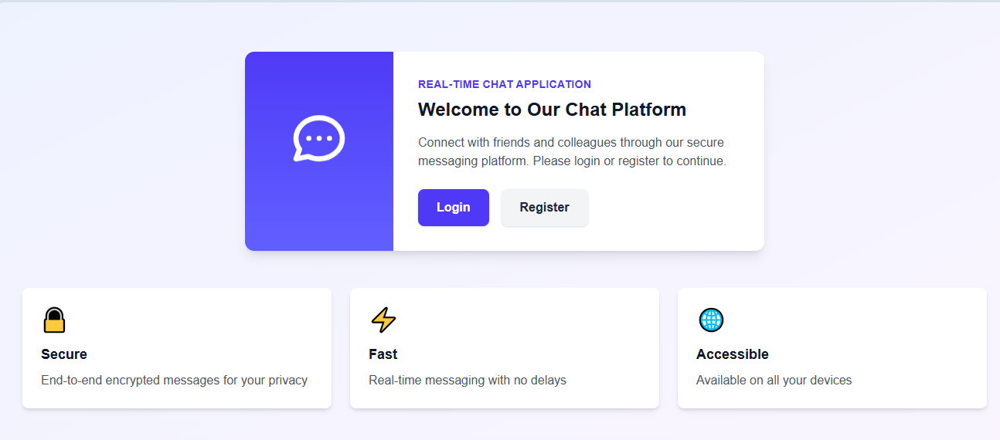
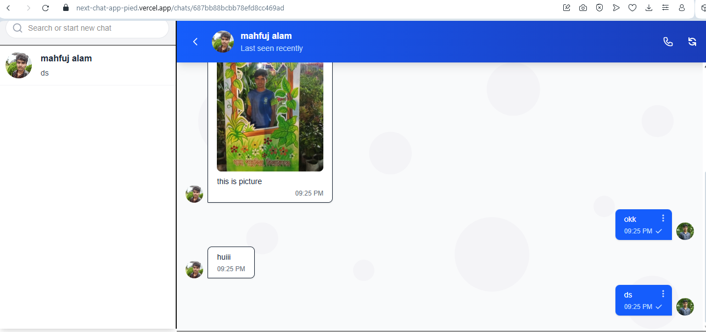

# 💬 Next.js Realtime Chat Web App

This is a **Next.js (App Router)** based chat web application featuring real-time communication, file transfer, user authentication, and more.

---

## 🔥 Features

- ✅ Built with **Next.js App Router**
- ✅ **Redux Toolkit** for state management
- ✅ **Multi-step registration form**
- ✅ **Firebase Authentication** (sign up/login)
- ✅ **MongoDB Atlas** for database storage
- ✅ **File transfer support** (send files/images in chat)
- ✅ **Realtime chat functionality** using **Node.js + Socket.IO** (in a separate repository)
- ✅ Clean and responsive user interface

---

## 🚀 Live Demo

🌐 **Live Application:**  
[Visit Live Site](https://next-chat-app-pied.vercel.app/)


---

## 🌐 Demo

📹 **Video Demo (Google Drive):**  
[Watch Demo](https://drive.google.com/your-demo-link)

🖼️ **Screenshots:**  







---

## 🔗 Realtime Server Code

The real-time backend is built using **Node.js** and **Socket.IO** and is hosted in a separate repository.

👉 [Go to Server Repository](https://github.com/mahfujalarony/socket-io-server-for-nextjs-chat)

---

## 🛠️ Tech Stack

| Technology      | Description                      |
|-----------------|----------------------------------|
| `Next.js`       | Frontend Framework (App Router)  |
| `Redux Toolkit` | State Management                 |
| `Firebase`      | Authentication                   |
| `MongoDB Atlas` | Cloud Database                   |
| `Node.js` + `Socket.IO` | Realtime communication   |
| `Firebase Storage / Cloudinary` | File Uploads     |

---

## 🏗️ Installation & Setup

### Prerequisites
- Node.js (v18 or higher)
- npm or yarn
- Firebase account
- MongoDB Atlas account

### Clone Repository
```bash
git clone https://github.com/yourusername/next-chat-app.git
cd next-chat-app
```

### Install Dependencies
```bash
npm install
# or
yarn install
```

### Environment Variables
Create a `.env.local` file in the root directory:

```env
# Firebase Configuration
NEXT_PUBLIC_FIREBASE_API_KEY=your_api_key
NEXT_PUBLIC_FIREBASE_AUTH_DOMAIN=your_auth_domain
NEXT_PUBLIC_FIREBASE_PROJECT_ID=your_project_id
NEXT_PUBLIC_FIREBASE_STORAGE_BUCKET=your_storage_bucket
NEXT_PUBLIC_FIREBASE_MESSAGING_SENDER_ID=your_sender_id
NEXT_PUBLIC_FIREBASE_APP_ID=your_app_id

# MongoDB Atlas
MONGODB_URI=your_mongodb_connection_string

# Socket.IO Server URL
NEXT_PUBLIC_SOCKET_SERVER_URL=http://localhost:3001
```

### Run Development Server
```bash
npm run dev
# or
yarn dev
```

Open [http://localhost:3000](http://localhost:3000) with your browser to see the result.

---

## 🚀 Deployment

### Deploy on Vercel
The easiest way to deploy your Next.js app is to use [Vercel](https://vercel.com):

[](https://vercel.com/new/clone?repository-url=https://github.com/yourusername/next-chat-app)

### Manual Deployment
```bash
npm run build
npm start
```

---

## 📁 Project Structure

```
next-chat-app/
├── src/
│   ├── app/
│   │   ├── auth/
│   │   ├── chat/
│   │   └── layout.js
│   ├── components/
│   │   ├── auth/
│   │   ├── chat/
│   │   └── ui/
│   ├── redux/
│   │   ├── store.js
│   │   └── slices/
│   └── lib/
├── public/
├── .env.local
└── package.json
```

---

## 🤝 Contributing

1. Fork the project
2. Create your feature branch (`git checkout -b feature/AmazingFeature`)
3. Commit your changes (`git commit -m 'Add some AmazingFeature'`)
4. Push to the branch (`git push origin feature/AmazingFeature`)
5. Open a Pull Request

---

## 📄 License

This project is licensed under the MIT License - see the [LICENSE](LICENSE) file for details.

---

## 👨‍💻 Author

**Your Name**
- GitHub: [@yourusername](https://github.com/yourusername)
- LinkedIn: [Your LinkedIn](https://linkedin.com/in/yourprofile)

---

## 🙏 Acknowledgments

- Next.js team for the amazing framework
- Firebase for authentication services
- MongoDB for database solutions
- Socket.IO for real-time communication

---

⭐ **If you find this project helpful, please give it a star!**